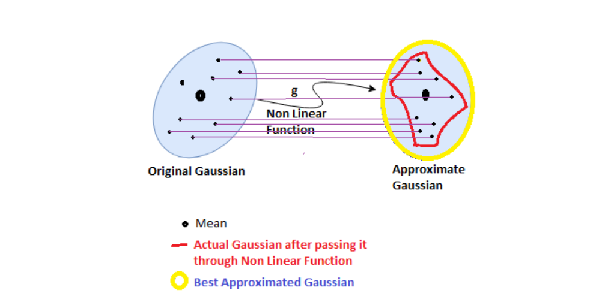

## General 
#### Question1: Explain a recent project you've worked on. Why did you choose this project? 
What difficulties did you run into this project that you did not expect, and how did you solve them?

Answer: I have worked on the game to system project extension working with Aristocrat for NSW extension/adaption.
This project is chosen as the latest project with my current employer for the same.

Strict timeline, first development in Sydney center, No document, Large code base need to update/extend adapt as a specification.

Add a document from code base by Doxygen, resolving issue day by day with help of simulator for a different event, message by adding c++ code for the protocol.

## Mandatory 
#### Question 2: What are some of the advantages & disadvantages of cameras, lidar and radar? What combination of these (and other sensors) would you use to ensure the appropriate and accurate perception of the environment?

Answers: Cameras, lidar, and radar are the eyes of a self-driving car,

```Camera```: A camera is fundamentally a sensor that grabs a bunch of color points in space and arranges them into an image, often referred to as an image array. This image array is converted into a digital signal and is passed along to the hardware that does sensor fusion and scene understanding.

```Lidar```: LiDAR is a laser-light point-and-shoot methodology for sensing the world. A transmitter spits out a bit of light, waits for that light to bounce off an object, and since it knows how fast light travels, can determine how far away that object is by determining the time that’s passed between sending out that light and receiving it. LiDAR units can broaden their field of view by using a bunch of lasers that spin around in a circle, or more recently, as a stationary bunch of lasers that spread out along a field of view, called “Solid State LiDAR.” After all the light is received, the LiDAR system sends an array of direction and distance information back to the hardware for sensor fusion and scene understanding, referred to as a “point cloud.

```Radar```: Radar has been around forever. It is similar to LiDAR in that it is a “point-and-shoot” technology, but uses radio, or electromagnetic, waves to do this. Radar lends itself well to long-distance object detection but is not typically very precise.
So how do you test this thing? Well, it’s just like LiDAR, but since the RADAR technology is less expensive and better understood, some companies are already creating tools for this purpose:

please see the image below to ensure the appropriate and accurate perception of the environment.


         Figure 1: McKinsey&Company Evaluation of Autonomous Vehicle Sensors
         
         


#### Question 3: Describe the overall process of how a basic Kalman Filter works. Where might a basic Kalman Filter be less than sufficient? How can you improve the basic algorithm to improve performance in such a situation?

Answers: Kalman Filters, also known as linear quadratic estimation (LQE), is an algorithm that helps us to obtain more reliable estimates from the sequence of observed measurements(sensor measurements).


It can be used to track the position and velocity of a moving pedestrian over time and also measure the uncertainty associated with them. It is basically a two-step iterative process.
Predict 🤔
Update ✍️

Actually, Kalman Gain is a parameter which decides how much weight should be given to predicted value and the measured value. It checks the uncertainty in both predicted value and measured value and then it decides whether our actual value is close to predicted value or measured value.

```K = Error In Prediction / (Error in Prediction + Error in Measurement)```

Error In Measurement is generally given by the sensor manufacturers. When we buy a new sensor, the manufacturer tells us the standard deviation of the measurement that we’ll get from the sensor. It means, let say the standard deviation is 3 and actual measurement is 150, then the sensor can give us the output ranges from 147–153.

Error In Prediction is calculated mathematically. We initially start with a wrong belief(large error) and then reduces the error gradually(using Kalman Gain) after taking the first few measurements from the sensor.

 [!link] <https://www.youtube.com/watch?v=Fuy73n6_bBc>


                  Figure 3: WikiIamge of Kalman filter
                  

Basic Kalman filter is less than sufficient if we have nonlinear measurement function from Gaussion[predicted state] to not a Gaussian result and Kalman filter equation cannot be used anymore. 

We have to use extended Kalman filter by using first order of Taylor expansion to construct a linear approximation.

#### Question 4: How does an Extended Kalman Filter differ from a regular Kalman Filter? Provide an example of where an EKF would be necessary or improvement, and detail why it would be needed in that situation.

Answer: Extended Kalman filter uses linear approximation approach as against the regular Kalman filter. Extended Kalman filter used when the result is not Gaussian  like radar/lidar and Kalman filter equation cannot be used through Taylor series expansion.
Lidar provided the distance in cartesian co-ordinate system while radar gives the distance and velosity in polar co-ordinate system.

## Bonus 

#### Question 5: What is the difference between an Extended Kalman Filter and an Unscented Kalman Filter? In what situations would there be larger differences between the two approaches?

Answer: Here the main difference from EKF is that in EKF we take only one point i.e. mean and approximate, but in UKF we take a bunch of points called sigma points and approximate with a fact that more the number of points, more precise our approximation will be!

In addition to sigma points, these points also have weights, so these are weighted sigma points.we are giving more or less preference to some points to make our approximation better.



## Coding

#### Question 6 :[Code] Explain the steps behind how an Extended Kalman Filter is implemented.
Answer: Please see extended Kalman filter implementation based on the code provided.
1.Taking data from diffrent source and cobining togther is called sensor fusion.
2. Data is put in the form of Matrix from diffrent source i.e Lidar , Radar and initilized.
3. The include file for the implementation for Kalman filter can be seen header file.[Gaussian Distrubution and liner function].
4. Feeding the data into the Gaussion form non liner data recied from Radar and get liner appriximation is called Extended kalman filter with helf Of Tylor series.
5. Prediction Step same 
x′ = F.x + B.μ + ν
P′ = FPFᵀ + Q
The prediction step is exactly the same as that of Kalman Filter. It does not matters whether the data is coming from LIDAR or RADAR the prediction step is exactly the same.

Update Step (Only in case of EKF i.e. Non Linear Measurements coming from RADAR)
Equation 1:
y= z - h(x′)
z -> actual measurement in polar coordinates
h -> function that specifies how our speed and position are mapped to polar coordinates
x′ -> Predicted Value
y -> Difference between Measured Value and Actual Value
h(x′)
This is a function that specifies the mapping between our predicted values in Cartesian coordinates and Polar coordinates. This mapping is required because we are predicting in Cartesian coordinates but our measurement (z) that is coming from the sensor is in Polar Coordinates.


Figure 8. Mapping between Cartesian and Polar coordinates (Source)
Equation 2:
S= HⱼP′Hⱼᵀ + R
K= P′HⱼᵀS⁻¹
R -> Measurement Noise
K -> Kalman Gain
S-> Total Error
S⁻¹ -> The inverse of S
Hⱼ -> The Jacobian Matrix
Hⱼ
Hⱼ is the Jacobian Matrix. The Jacobian matrix is the first order derivative that we just discussed in Taylor Series. Since here we are dealing with matrices, we need to find differential in the form of a matrix.

J_kl = d F_k / dX_l
J_kl is the k,l element of the Jacobian matrix, F_k is the kth element of the vector function F, and X_l is the lth element of the vector variable X.
Here F_k = { ρ, Φ , ρ_dot}
X_l = {px,py,vx,vy}

Since in case of RADAR we have 4 measurements, 2 for distance and 2 for velocity.


Figure 9. Jacobian matrix (Source)

Figure 10. Jacobian Matrix after applying derivatives
Equation 3:
x = x′ + K.y
P = (I- KHⱼ)P′


all can be seen in the form of three steps i.e Initiozation/conditiob check
Prediction
update
Note: no need to go in deep , please have a look of code base.


